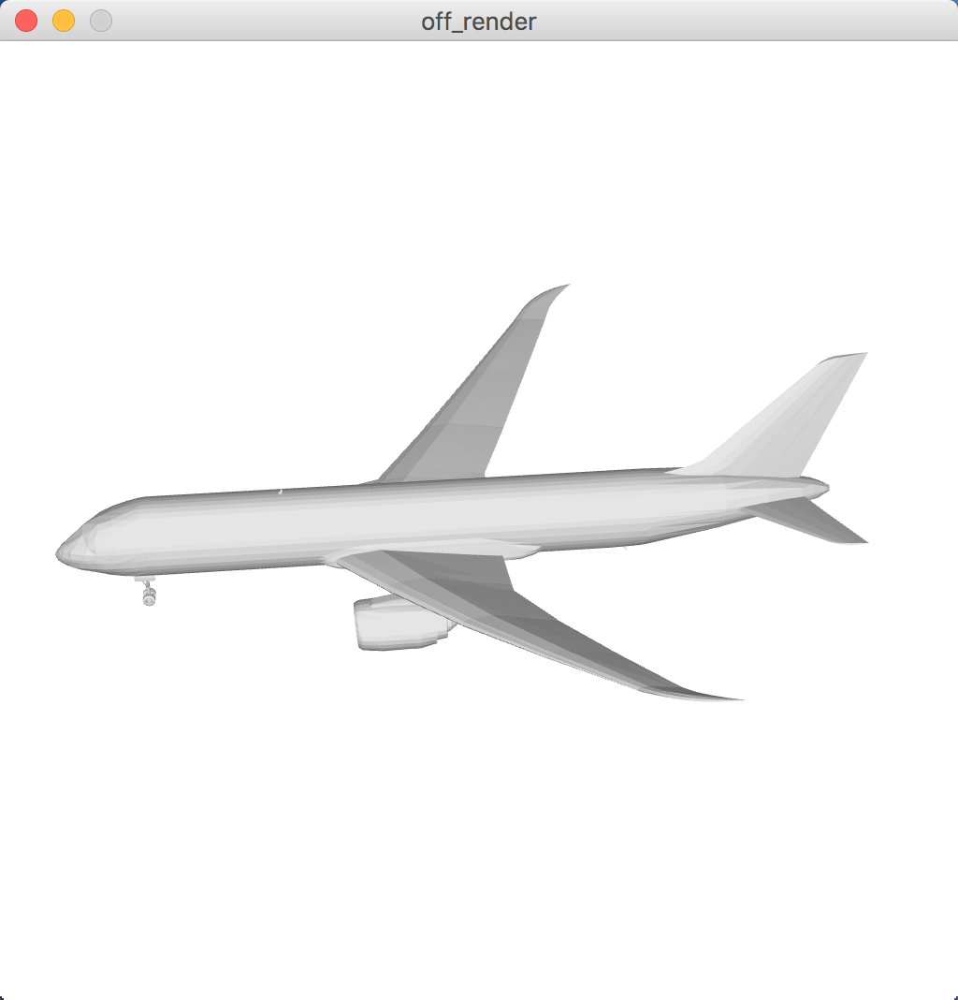

# off_render  
> render .off file to images or display  

## requirements  
* \>= python3.5
* ModernGL
* PyQt5

### install requirements instructions
```bash  
pip3 install moderngl
pip3 install pyqt5  
```  
 
## render to display
```bash  
usage: display_window.py [-h] OFF_FILE

positional arguments:
  OFF_FILE    the off_file you want to render

optional arguments:
  -h, --help  show this help message and exit

```
example
```bash  
python3 display_window.py demo_assets/airplane_0636.off 
```  



## render to images
```bash  
usage: render.py [-h] [--views N] [--dodecahedron] OFF_FILE

positional arguments:
  OFF_FILE        the off_file you want to render

optional arguments:
  -h, --help      show this help message and exit
  --views N       count of views to render, default is 12
  --dodecahedron  use dodecahedron camera settings

```
example
```bash  
python3 render.py demo_assets/car_0267.off  
python3 render.py --dodecahedron demo_assets/car_0267.off
```  

## render `Modelnet`  
no doc:-\)